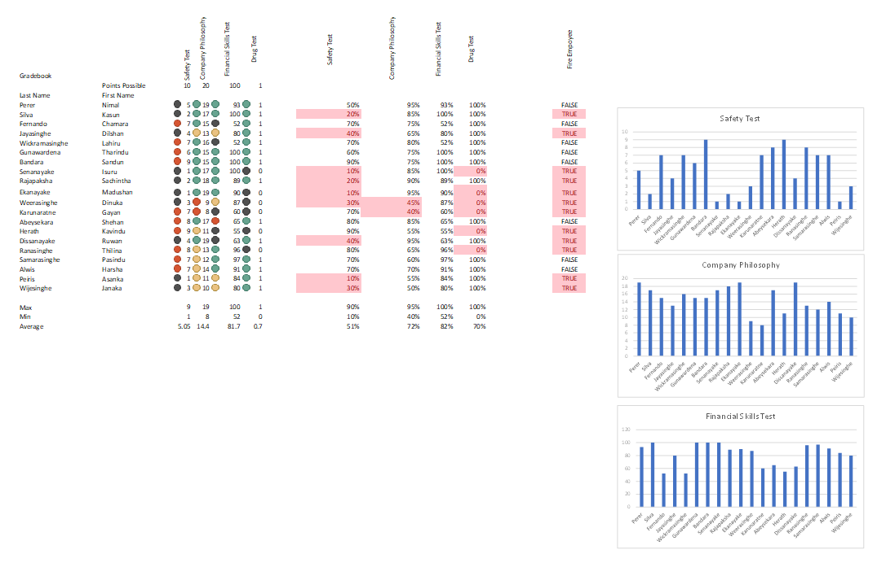
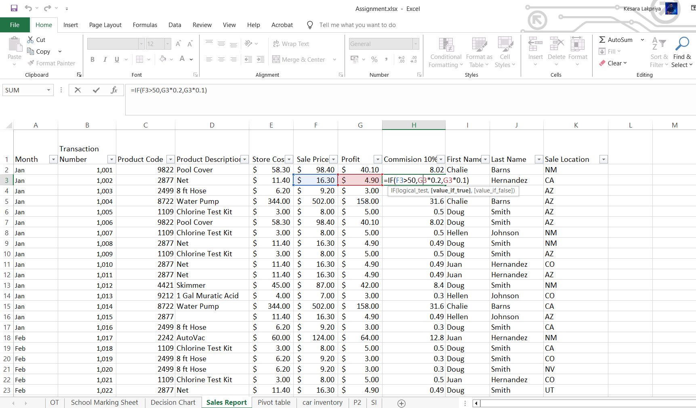
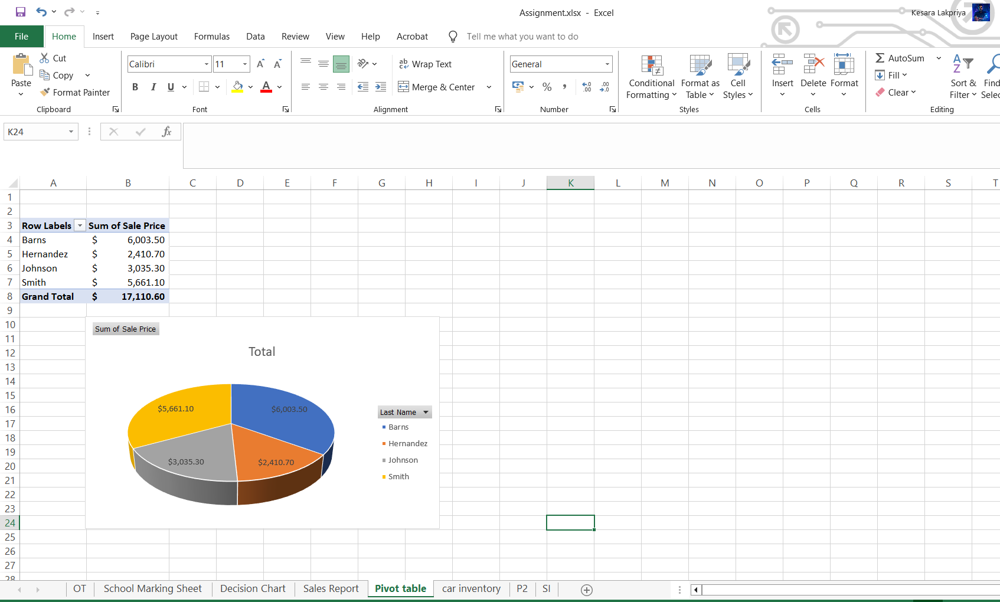
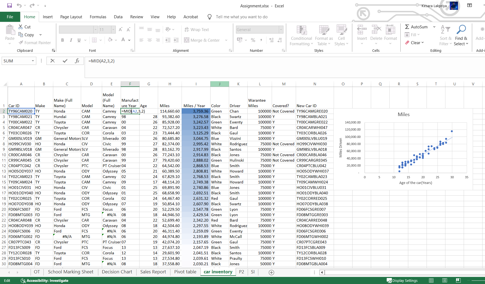
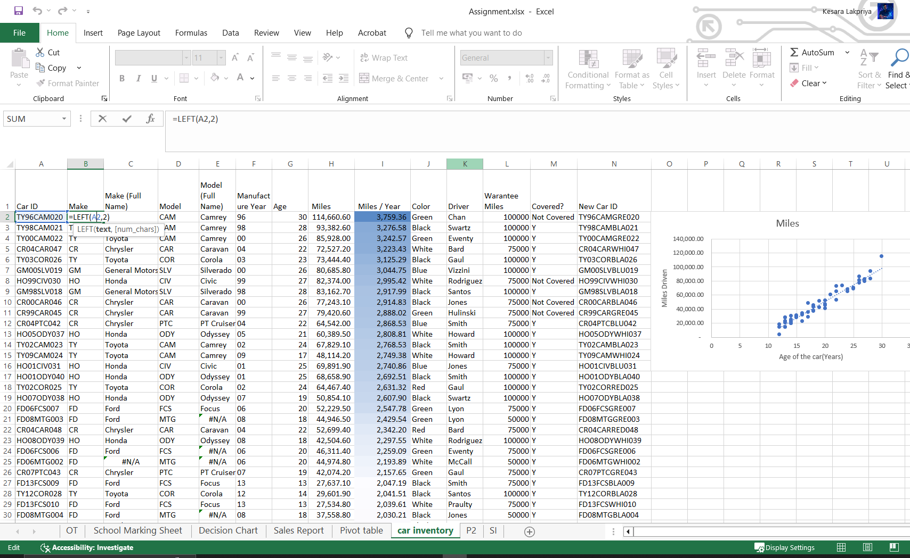
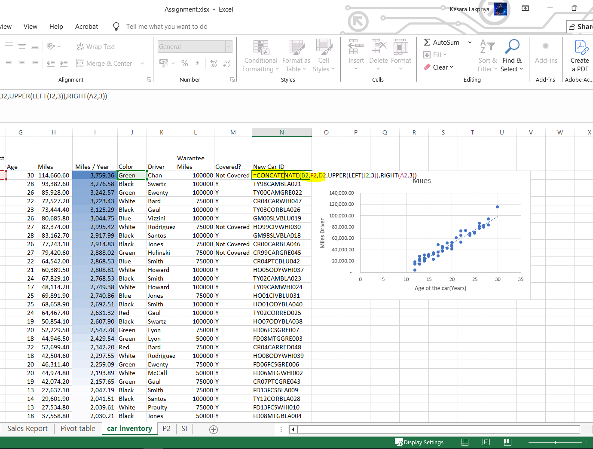
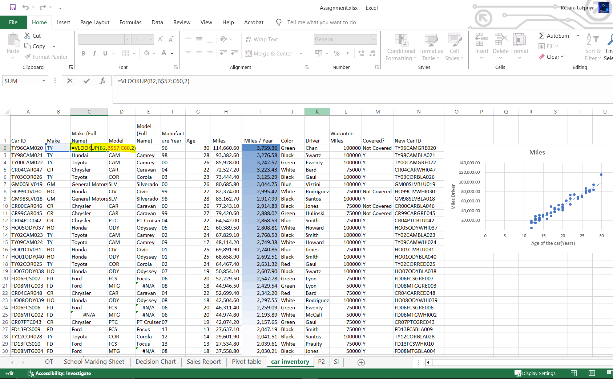
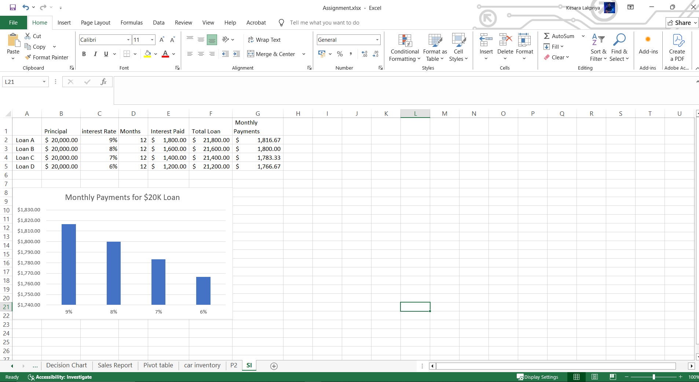

# Excel Data Analysis Portfolio

My first Excel Data Analysis Portfolio showcasing practical projects in formulas, reporting, pivot tables, charts, and business data analysis.

## Skills Demonstrated

* IF and OR Functions
* SUM, MIN, MAX and AVERAGE
* VLOOKUP and HLOOKUP
* LEFT, RIGHT and MID Functions
* CONCATENATE
* Sort and Filter
* Pivot Tables
* Pie Charts
* Data Visualization
* Business Reporting
* Loan Interest Calculator

## Project Screenshots

### Screenshot 1

### Screenshot 2

### Screenshot 3

### Screenshot 4

### Screenshot 5

### Screenshot 6

### Screenshot 7

### Screenshot 8

## Tools Used

* Microsoft Excel

## Author

Kesara Lakpriya
## Aspiring Data Analyst
